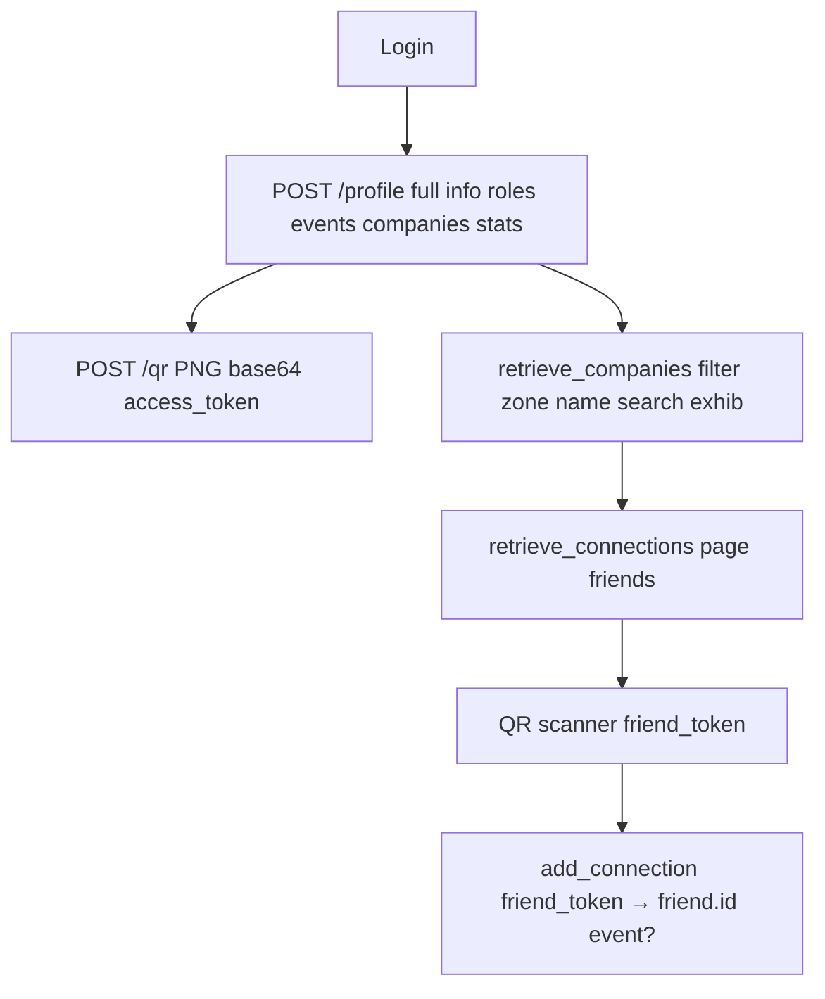

# Application Features & User Flow Documentation

## Overview
Multi-tenant event platform. JWT login → role-based dashboard. All POST body JSON, paginated lists, soft delete, auth middleware.

**Roles** (hierarchical super_admin > event_admin > security > exhib_staff/visitor):
- **super_admin**: full CRUD users/events/zones/companies
- **event_admin**: own events/zones/companies/staff
- **security**: scan QR zones companies enter/exit
- **exhibitor_staff/visitor**: profile QR companies connections scan add

## User Flow (Mermaid)

### Super Admin Flow
```mermaid
graph TD
    Login[Login POST /login] --> SuperDash[Dashboard Stats]
    SuperDash --> Employees[retrieve_users filter company/role/search page]
    Employees --> AddUser[add_user + role event_id]
    Employees --> UpdateUser[update_user fields]
    Employees --> DelUser[delete_user id]
    SuperDash --> Events[retrieve_events search organizer]
    Events --> AddEvent[add_events slug title dates venue organizer]
    Events --> UpdateEvent
    Events --> DelEvent
    SuperDash --> Zones[retrieve_zones event search]
    Zones --> AddZone
    SuperDash --> Companies[retrieve_companies event zone search]
    Companies --> AddCompany event zone name
```

### Event Admin Flow
```mermaid
graph TD
    Login --> EventDash[Own Events Stats]
    EventDash --> Events[retrieve_events organizer=me]
    Events --> AddEvent own organizer_id
    EventDash --> Zones[retrieve_zones event=own]
    Zones --> AddZone event_id=own
    EventDash --> Companies[retrieve_companies event=own zone]
    Companies --> AddCompany own event zone
    EventDash --> Staff[retrieve_users company role event=own]
```

### Security Flow
```mermaid
graph TD
    Login --> SecDash[Companies List search event zone]
    SecDash --> Companies[retrieve_companies exhib booths]
    Companies --> ZonesList[retrieve_zones event]
    ZonesList --> CamScan[QR scanner frontend → access_token]
    CamScan --> ScanValidate[POST /scan_validate access_token zone_id action enter/exit]
    ScanValidate -->|ok| AddZoneScan EventAttendance toggle state
    ScanValidate -->|denied| Denied{already_in denied_role inactive}
```

### Staff/Visitor Flow


## Backend APIs Summary
See [`plans/api-docs.md`](plans/api-docs.md) endpoints/cURL.

**Key Logic**:
- Pagination {data[], total, page, limit} POST body page/limit
- Lists join rels (company_name organizer_name zone_name)
- CRUD model methods validate uq hash
- Scan: get_by_access_token user active role match event/zone company toggle last scan enter/exit capacity
- Auth: opaque JWT DB Sessions table validate token not expired/killed

**Frontend Integration**:
- React? QR scanner jsQR/quagga → access_token → API
- Dashboard filters pagination POST body
- Cam QR for attendance/connections

**Tech**:
- Flask SQLAlchemy Postgres UUID PK soft delete enums JWT HS256 DB sessions
- Docker compose db app
- main.py daemon flask 6000 debug

Restart app test flows.