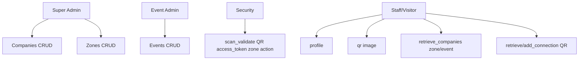

# Remaining API Routes Plan

## Overview
Complete CRUD for remaining entities (Companies, Connections, ZoneScans, EventAttendance) + Security/Staff endpoints (scan_validate, profile, qr, retrieve_companies, retrieve_connections, add_connection). Follow pattern: model methods, route auth/log/response, paginated list join rels, docs.

**Priority Order**:
1. Companies CRUD (event/zone scoped)
2. Zones companies retrieve (already planned)
3. Security scan_validate (QR logic)
4. Staff profile/qr/retrieve_companies/retrieve_connections/add_connection
5. Attendance/Scans CRUD (internal)

## Mermaid API Flow

## Detailed Routes

### Companies (Super/Event Admin)
Dir `API/routes/companies/`
- POST /retrieve_companies {event_id? zone_id? search:name page limit} RetrieveCompanies.list_paginated join zone event {data [id name booth slug logo desc website industry email phone zone_name event_name]}
- POST /add_company {event_id* zone_id* name*} AddCompanies.add uq?
- POST /update_company {id* ...}
- POST /delete_company {id*}

Extend RetrieveCompanies.list_paginated(event_id=None, zone_id=None, search=None...)

### Connections CRUD (Staff/Visitor)
Dir `API/routes/connections/`
- POST /retrieve_connections {page limit} RetrieveConnections.list(auth_user.id) friends
- POST /add_connection {friend_access_token*} get friend by token, AddConnections(user.id, friend.id, event_id?)
- POST /delete_connection {id*} or friend_id

### ZoneScans / EventAttendance (Security internal?)
No route yet, CRUD if needed.

### Security Scan
POST /scan_validate {access_token* zone_id* event_id? action 'enter'/'exit'} complex logic validate user role capacity toggle etc AddZoneScans AddEventAttendance response status message user info

### Staff
POST /profile {} RetrieveUsers.get_full_profile(auth.id)
POST /qr {} gen QR access_token png base64
POST /retrieve_companies {search? zone_id? event_id? page} exhib companies

Dir `API/routes/staff/` or security.

## Next Steps Todo
- [ ] Companies CRUD
- [ ] Connections CRUD
- [ ] scan_validate
- [ ] staff profile qr retrieve_companies retrieve_connections add_connection
- [ ] Register blueprints
- [ ] Docs

All POST body, auth, paginated, joins rels, model methods.