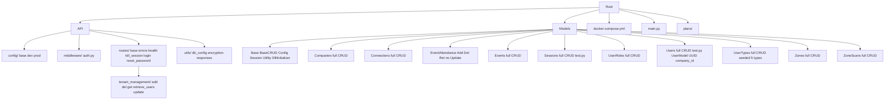

# Project Architecture Map

## Overview
This is a **multi-tenant event management backend API** built with **Flask**, **SQLAlchemy ORM**, and **PostgreSQL**. Supports users with roles/types/companies, events, attendance tracking, zone scanning (enter/exit), connections, JWT authentication with tokens stored/validated via Sessions table, and CRUD operations for core entities.

Key Features:
- User registration/login (email/pass), password reset, session kill.
- Hierarchical users (super_admin, event_admin, security, exhibitor_staff, visitor via UserTypes/UserRoles).
- Event/zone/attendance/scan management (models ready, API pending).
- Soft deletes (deleted_at/is_active), UUID PKs.
- Dockerized (Postgres + Flask app).
- .env config, logging to console/application.log.
- Enums: user_role, scan_action.

**Entry Point**: [`main.py`](main.py) - logging, DB config/env, init tables/seed (FORCE_SEED), `create_app()` Flask in daemon thread on 0.0.0.0:6000 (debug=True, use_reloader=False).

## Directory Structure
```
event/
├── .env                          # DB_USER/PASS/HOST/PORT/NAME, SECRET_KEY
├── docker-compose.yml            # Postgres db + app services
├── main.py                       # Entry: logging, DB init/seed, create_app, run threaded
├── requirements.txt              # Flask, SQLAlchemy, psycopg2-binary, python-jose, etc.
├── migrate.py                     # Alembic migration runner?
├── Dockerfile                    # App build
├── docker-setup.md               # ?
├── project-architecture-map.md   # This doc
├── application.log               # Logs
├── plans/
│   ├── api-structure-summary.md     # API structure summary
│   ├── event-models-plan.md         # Event models implementation plan
│   └── update-login-response.md     # Planned login response update
├── API/
│   ├── __init__.py               # create_app(): config, CORS, register /api/v1 blueprints, g.sessions
│   ├── config/
│   │   ├── __init__.py
│   │   ├── base.py
│   │   ├── development.py
│   │   └── production.py
│   ├── middleware/
│   │   ├── __init__.py
│   │   └── auth.py               # AuthManager: JWT gen/validate via Sessions DB lookup
│   ├── routes/
│   │   ├── __init__.py           # Placeholder
│   │   ├── base.py               # BaseRoute?
│   │   ├── errors.py             # register_error_handlers
│   │   ├── health.py             # HealthRoute imported unused
│   │   ├── kill_session.py
│   │   ├── login.py              # /login POST validate_login gen token AddSessions
│   │   ├── reset_password.py
│   │   └── tenant_management/
│   │       ├── __init__.py
│   │       ├── add_tenant.py
│   │       ├── delete_tenant.py
│   │       ├── get_user.py
│   │       ├── retrieve_users.py
│   │       └── update_tenant.py
│   └── utils/
│       ├── __init__.py
│       ├── db_config.py
│       ├── encryption.py          # PasswordHasher?
│       └── responses.py           # success/error_response
├── Models/
│   ├── __init__.py
│   ├── Base.py                   # Base = declarative_base()
│   ├── BaseCRUD.py               # Generic CRUD: add(hash pass), list(active), update, delete(soft?), commit@
│   ├── Configuration.py          # DB config
│   ├── DatabaseInitializer.py    # create_all(seed enums/types/user/role)
│   ├── Session.py                # DatabaseSession engine/sessionmaker
│   ├── Utility.py                # Validators/error handle
│   ├── Companies/                # Full CRUD: Add/Delete/Retrieve/UpdateCompanies.py Companies.py __init__.py
│   ├── Connections/              # Full CRUD
│   ├── EventAttendance/          # Add/Delete/RetrieveEventAttendance.py EventAttendance.py __init__.py (no Update)
│   ├── Events/                   # Full CRUD
│   ├── Sessions/                 # Full CRUD + test.py UpdateSessions.py UserSessions.py __init__.py
│   ├── UserRoles/                # Full CRUD UserRoles.py
│   ├── Users/                    # Full CRUD + test.py Users.py UserModel __init__.py
│   ├── UserTypes/                # Full CRUD UserTypes.py
│   ├── Zones/                    # Full CRUD
│   └── ZoneScans/                # Full CRUD
└── migrations/                   # Alembic: env.py README script.py.mako
```

**Mermaid Directory Diagram**


## Models / ORM Pattern
**Single declarative base**: [`Models/Base.py`](Models/Base.py:4) `Base = declarative_base()`

**Model Definition** e.g. [`Models/Users/Users.py`](Models/Users/Users.py:11):
```python
class UserModel(Base):
    __tablename__ = 'users'
    id = Column(UUID(as_uuid=True), primary_key=True, server_default=text('gen_random_uuid()'))
    email = Column(Text, nullable=True)  # uq
    phone = Column(Text, nullable=True)  # uq
    password_hash = Column(Text, nullable=False)
    first_name/last_name = Column(String(100), nullable=False)
    company_id = Column(UUID, ForeignKey('companies.id', ondelete='SET NULL'))
    access_token = Column(UUID, unique=True, server_default=gen_random_uuid())
    token_expires_at/last_rotated_at = DateTime
    is_active = Boolean default true
    deleted_at = DateTime  # soft delete
    created_at/updated_at = DateTime now()
    # Indexes uq email/phone/access_token, company_id
    # rel: sessions = relationship("UserSessions", back_populates="user")
```

**Sessions**: UserSessions Token str, UserID FK UUID?, Start/EndTime, Status int.

**Model Package Structure** (e.g. Users/, all similar):
- [`__init__.py`](Models/Users/__init__.py): Docs \"Contents: - Users: model - AddUsers: ...\", `from .Users import UserModel; from .AddUser import AddUsers ...`, `__all__ = [...]`
- `Users.py` / `UserSessions.py`: Model class.
- `AddUsers.py`: `class AddUsers(BaseCRUD): def add(first_name, email, password, ...): validate + self.add(**data)` (super or manual)
- `DeleteUser.py`: `def delete(id): super().delete(id)`
- `RetrieveUsers.py`: `def get_by_email(email); validate_login(email,pass) -> user; ...`
- `UpdateUser.py`: `def update(id, **kwargs): validate + super().update`
- `test.py` (some): examples.

**CRUD Base** [`Models/BaseCRUD.py`](Models/BaseCRUD.py:10): `__init__(session, model_class)`, `@commit_transaction` add/list/get_by_id/update/delete (soft if Status?, hard del), `_hash_password_if_present(kwargs)`.

**Table Registration**: [`Models/DatabaseInitializer.py`](Models/DatabaseInitializer.py:27) `*.Base.metadata.create_all(engine)` order deps.

## API / Routes / Data Flow
**App Factory** [`API/__init__.py`](API/__init__.py:19) `create_app()`: Flask(DevelopmentConfig), CORS /api/v1/* origins *, register_blueprint(route.bp, url_prefix='/api/v1') for:
- LoginRoute [`API/routes/login.py`](API/routes/login.py:12)
- RetrieveUsersRoute, AddTenantRoute, DeleteTenantRoute, UpdateTenantRoute, GetUserRoute (tenant_management/)
- ResetPasswordRoute, KillSessionRoute

Each: `class *Route(BaseRoute): def __init__(): super() self.auth_manager=AuthManager() def register_routes(): self.bp.route('/endpoint', methods=['POST'])(self.handler)`

**Example Login**: json {email,pass}, RetrieveUsers.validate_login -> user, AuthManager.generate_token(user.id), AddSessions(UserID, Token=token, Start/End=now+1h, Status=1), return {token, UserType, FirstName...}

**Auth Flow** [`API/middleware/auth.py`](API/middleware/auth.py:12): generate_token(id): jwt.encode({'user_id':id, exp:1h}, SECRET_KEY HS256). authenticate_request(token): RetrieveSessions.get_by_token(token)[0], check EndTime > now & Status !=2 (expired/killed). No payload decode, token opaque DB key.

**before_request**: `g.sessions = []`; `@teardown_appcontext`: close g.sessions.

**Responses**: utils.responses success_response(data,200), error_response(msg,400)

**Error Handlers**: routes.errors.register_error_handlers(app)

**Note**: HealthRoute imported not registered; no routes for event models.

## DB Initialization / Seeding
**main.py** [`main.py`](main.py:40): config=Configuration(DB env), db_session=DatabaseSession(config). If !db exist create; if !tables DatabaseInitializer.initialize_tables(engine); initialize_records(session)

**Tables** [`Models/DatabaseInitializer.py`](Models/DatabaseInitializer.py:27): create_all each package Base.metadata:
1. UserTypes 2.Users 3.Events 4.Zones 5.Companies 6.UserRoles 7.EventAttendance 8.ZoneScans 9.Connections 10.Sessions

**Records** [`Models/DatabaseInitializer.py`](Models/DatabaseInitializer.py:48): CREATE TYPE user_role ENUM('super_admin','event_admin','security','exhibitor_staff','visitor'), scan_action('enter','exit'); AddUserTypes.add 5 types; if !admin AddUsers.add('Zakaria Alyafawi', zakariaaalyafawi@gmail.com, 'Abcdef@12345'); AddUserRoles.add_role(admin.id, super_admin.id)

## Deployment (Docker)
[`docker-compose.yml`](docker-compose.yml): 
services:
  db: postgres:15-alpine, POSTGRES_DB=${DB_NAME:-vision}, USER postgres PASS 1234, ports ${DB_PORT:-5432}:5432, vol postgres_data, health pg_isready
  app: build ., ports 5000:5000, env DB_HOST=db ..., SECRET_KEY, depends db healthy

.volumes postgres_data

**Run**: docker-compose up -d; .env set vars.

**Dockerfile**: Builds app (python deps from requirements.txt).

## Missing Components / Issues
- **API Gaps**: No blueprints/routes for Events/Zones/ZoneScans/EventAttendance/Companies/Connections (CRUD models ready but no endpoints).
- **HealthRoute**: Imported in API/__init__.py line 13 but not instantiated/registered.
- **CRUD Variations**: EventAttendance missing [`UpdateEventAttendance.py`](Models/EventAttendance/); Users CRUD files singular (AddUser.py etc.) vs plural others.
- **Model Evolutions**: Users UUID PK (gen_random_uuid()), company_id FK; password_hash but BaseCRUD hashes 'Password'→'Password'=hashed (ignored, bug); no UserType FK (roles UserRoles join).
- **Notes/Bugs**: Sessions UserID UUID (good); no user.Type (roles join); BaseCRUD password bug (above).
- **Alembic**: migrations/ present; migrate.py at root (TBD).
- **Soft Delete**: BaseCRUD Status=3 if present (Sessions?), else hard; Users use deleted_at/is_active.
- **BaseCRUD Password Bug**: Hashes 'Password'→sets 'Password'=hashed (no column, ignored).
- **TODOs**: One [`API/routes/tenant_management/delete_tenant.py`](API/routes/tenant_management/delete_tenant.py:100).
- **Ports**: main.py dev 6000; docker 5000.
- **Tests**: Users/Sessions test.py.

## Summary
Comprehensive event platform backend skeleton: Robust ORM CRUD packages for 10+ entities, auth system (JWT DB sessions), user/tenant mgmt API, full DB auto-init/seed (admin ready), Docker deploy. Next: Implement event CRUD APIs, fix inconsistencies, add tests/health, migrate to UUID consistently, Alembic migrations.
